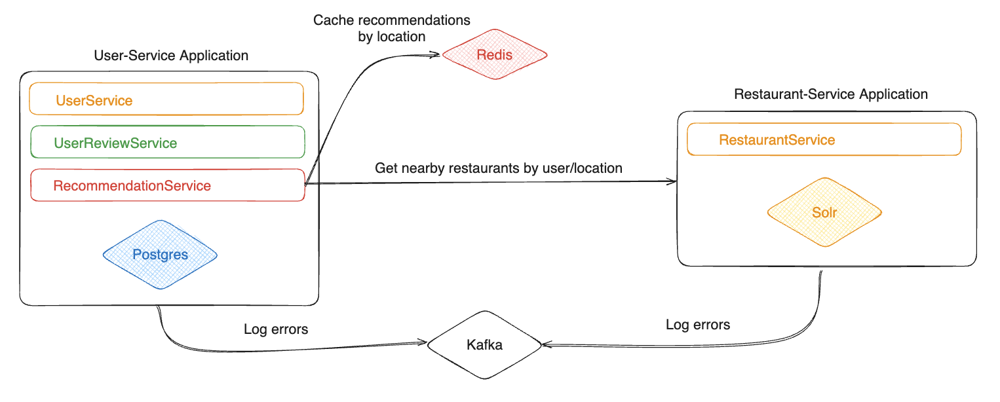

# Restaurant Recommendation API

## Technologies

- Restaurant Service
    - JDK 17
    - Spring Boot 2.7.7
    - Solr 9.5
    - Kafka
- User Service
    - JDK 21
    - Spring Boot 3.2.3
    - Postgres 16
    - Redis
    - Kafka
    - jUnit 5
    - Mockito
- Docker

## Architecture



## Features

- Create, update, delete and list restaurants
- Create, update, delete and list users
- Create, update (score and comment), delete and list reviews
- Get recommendations by user id
- Get recommendations by location (latitude and longitude)
- Pagination and sorting for `GET /api/v1/restaurants`, `GET /api/v1/users` and `GET /api/v1/reviews`
- Search restaurant by name
- Unit and integration tests for user service application
- Validation for all endpoints

## Rooms for improvement
- Create separate APIs for users, reviews, and recommendations
- Apply CQRS pattern to services, especially for restaurant service.
    - Postgres for write operations
    - Solr for read operations
- Add more unit and integration tests for restaurant service application
- gRPC for communication between services might be a better choice than REST
- Manhattan distance might be a better choice for distance calculation thus cities usually have a grid-like structure


## How to run

### Docker

All services have their own Dockerfile and can be run using docker-compose.
Docker VM on host machine should have at least 4GB of RAM and 4 CPUs otherwise you may encounter problems when compiling
or running services. Wait until container with name `init-data` shuts down.

```bash
docker compose up -d
```

After running this command it will download some images and build the services.
This process may take up to 10 minutes depends on your bandwidth speed.

### Local/IDE (faster)

If you would like to run services locally (without creating Docker containers), open the project with your IDE.
At first IDEA may ask for importing maven projects, click to yes.
You need to run some services on Docker:

- Solr
- Postgres
- Redis
- Kafka
- Zookeeper

You can run them with a different Docker compose file

```bash
docker compose -f compose-local.yaml up -d
```

After starting these services, you can start the Restaurant Service `(:8082)`.
Then you can start the User Service `(:8081)`.

Then wait until `init-data` container shuts down, this will set up Solr schema and add some data to databases.

### Swagger UI

- User Service: http://localhost:8081/swagger-ui/index.html
- Restaurant Service: http://localhost:8082/swagger-ui/index.html

## Running tests

You need to start `test-postgres` service in `compose.yaml` before running the services.
It is disabled by default because it is not necessary for running the services.


In total 53 test cases available.

## API Preview

### Restaurant Service


### User Service

